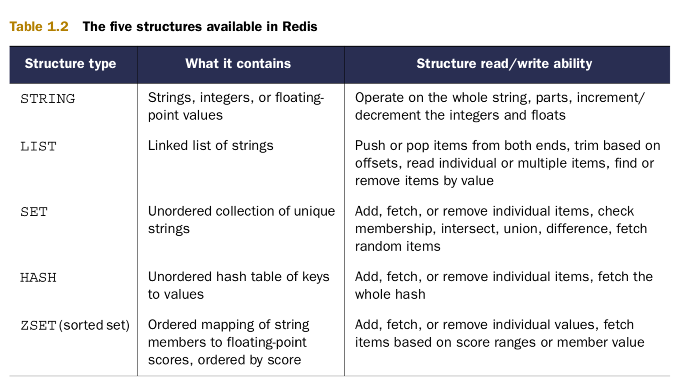

# Redis - in-memory database :

    - Story behind Creation of Redis :

    Redis was created about three years ago for practical reasons: basically, I was trying to do the impossible with an on-disk SQL database. I was handling a large write-heavy load with the only hardware I was able to afford—a little virtualized instance.
    My problem was conceptually simple: my server was receiving a stream of page views from multiple websites using a small JavaScript tracker. I needed to store the lat- est n page views for every site and show them in real time to users connected to a web interface,
    while maintaining a small history.

    With a peak load of a few thousand page views per second, whatever my database schema was, and whatever trade-offs I was willing to pick, there was no way for my SQL store to handle the load with such poor hardware. My inability to upgrade the hard- ware for cost
    concerns coupled with the feeling that to handle a capped list of values shouldn’t have been so hard, after all, gave me the idea of creating a throw-away pro- totype of an in-memory data store that could handle lists as a native data type, with constant-time pop
    and push operations on both sides of the lists. To make a long story short, the concept worked, I rewrote the first prototype using the C language, added a fork-based persistence feature, and Redis was born.

    - Author is first use of Redis :

    + My first experience with Redis was at a company that needed to search a data- base of client contacts. The search needed to find contacts by name, email address, location, and phone number. The system was written to use a SQL database that performed a series of queries
      that would take 10–15 seconds to find matches among 60,000 clients. After spending a week learning the basics of what was available in Redis, I built a search engine that could filter and sort on all of those fields and more, returning responses within 50 milliseconds.

    - Setting-up Redis on MacOS :
    $ brew install redis

    $ redis-server
    $ redis-server /usr/local/etc/redis.conf

    What is Redis?
    When I say that Redis is a database, I’m only telling a partial truth. Redis is a very fast non-relational database that stores a mapping of keys to five different types of values. Redis supports in-memory persistent storage on disk, replication to scale read perfor- mance,
    and client-side sharding1 to scale write performance. That was a mouthful, but I’ll break it down by parts.

    - It’s not uncommon to hear Redis compared to memcached, which is a very high- performance, key-value cache server. Like memcached, Redis can also store a mapping of keys to values and can even achieve similar performance levels as memcached.

    + Generally speaking, many Redis users will choose to store data in Redis only when the performance or functionality of Redis is necessary, using other relational or non-relational data storage for data where slower performance is accept- able, or where data
    is too large to fit in memory economically.

    When using an in-memory database like Redis, one of the first questions that’s asked is “What happens when my server gets turned off?” Redis has two different forms of per- sistence available for writing in-memory data to disk in a compact format. The first method is a
    point-in-time dump either when certain conditions are met (a number of writes in a given period) or when one of the two dump-to-disk commands is called. The other method uses an append-only file that writes every command that alters data in Redis to disk as it happens.
    Depending on how careful you want to be with your data, append-only writing can be configured to never sync, sync once per second, or sync at the completion of every operation.

    Even though Redis is able to perform well, due to its in-memory design there are situations where you may need Redis to process more read queries than a single Redis server can handle. To support higher rates of read performance (along with handling failover if the server
    that Redis is running on crashes), Redis supports master/slave replication where slaves connect to the master and receive an initial copy of the full database. As writes are performed on the master, they’re sent to all connected slaves for updating the slave datasets in real time.
    With continuously updated data on the slaves, clients can then connect to any slave for reads instead of making requests to the master.

    - writes to Redis data are always fast, because data is always in memory, and queries to Redis don’t need to go through a typical query parser/optimizer.

    ! Redis - Use case :

    + By using Redis instead of a relational or other primarily on-disk database, you can avoid writing unnecessary temporary data, avoid needing to scan over and delete this temporary data, and ultimately improve performance. These are both simple exam- ples, but they demonstrate how your choice of tool can greatly affect the way you solve your problems.
    - As you continue to read about Redis, try to remember that almost everything that we do is an attempt to solve a problem in real time

    1.2 What Redis data structures look like :
    - Redis allows us to store keys that map to any one of five different data structure types; STRINGs, LISTs, SETs, HASHes, and ZSETs. Each of the five differ- ent structures have some shared commands (DEL, TYPE, RENAME, and others), as well as some commands that can only be used by one or two of the structures

    - Set-up python env :

    $ sudo python -m easy_install redis hiredis (hiredis is an optional performance-improving C library).

