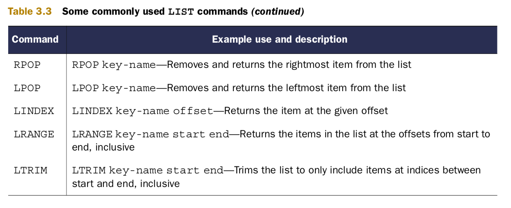
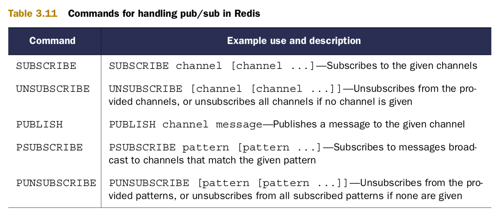
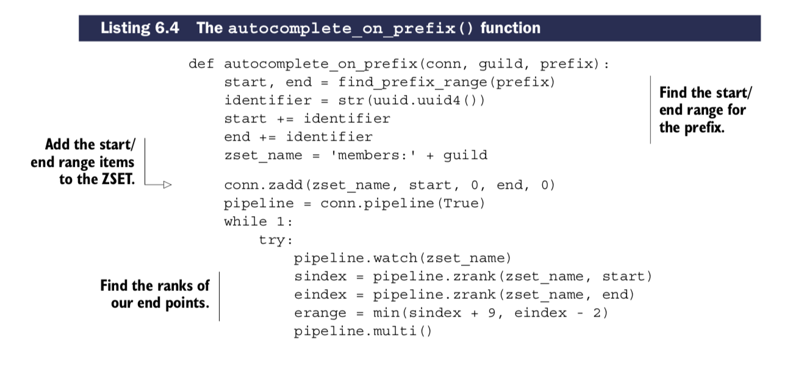

# Redis - in-memory database :

    - Story behind Creation of Redis :

    Redis was created about three years ago for practical reasons: basically, I was trying to do the impossible with an on-disk SQL database. I was handling a large write-heavy load with the only hardware I was able to afford—a little virtualized instance.
    My problem was conceptually simple: my server was receiving a stream of page views from multiple websites using a small JavaScript tracker. I needed to store the lat- est n page views for every site and show them in real time to users connected to a web interface,
    while maintaining a small history.

    With a peak load of a few thousand page views per second, whatever my database schema was, and whatever trade-offs I was willing to pick, there was no way for my SQL store to handle the load with such poor hardware. My inability to upgrade the hard- ware for cost
    concerns coupled with the feeling that to handle a capped list of values shouldn’t have been so hard, after all, gave me the idea of creating a throw-away pro- totype of an in-memory data store that could handle lists as a native data type, with constant-time pop
    and push operations on both sides of the lists. To make a long story short, the concept worked, I rewrote the first prototype using the C language, added a fork-based persistence feature, and Redis was born.

    - Author is first use of Redis :

    + My first experience with Redis was at a company that needed to search a data- base of client contacts. The search needed to find contacts by name, email address, location, and phone number. The system was written to use a SQL database that performed a series of queries
      that would take 10–15 seconds to find matches among 60,000 clients. After spending a week learning the basics of what was available in Redis, I built a search engine that could filter and sort on all of those fields and more, returning responses within 50 milliseconds.

    - Setting-up Redis on MacOS :
    $ brew install redis

    $ redis-server
    $ redis-server /usr/local/etc/redis.conf

    What is Redis?
    When I say that Redis is a database, I’m only telling a partial truth. Redis is a very fast non-relational database that stores a mapping of keys to five different types of values. Redis supports in-memory persistent storage on disk, replication to scale read perfor- mance,
    and client-side sharding1 to scale write performance. That was a mouthful, but I’ll break it down by parts.

    - It’s not uncommon to hear Redis compared to memcached, which is a very high- performance, key-value cache server. Like memcached, Redis can also store a mapping of keys to values and can even achieve similar performance levels as memcached.

    + Generally speaking, many Redis users will choose to store data in Redis only when the performance or functionality of Redis is necessary, using other relational or non-relational data storage for data where slower performance is accept- able, or where data
    is too large to fit in memory economically.

    When using an in-memory database like Redis, one of the first questions that’s asked is “What happens when my server gets turned off?” Redis has two different forms of per- sistence available for writing in-memory data to disk in a compact format. The first method is a
    point-in-time dump either when certain conditions are met (a number of writes in a given period) or when one of the two dump-to-disk commands is called. The other method uses an append-only file that writes every command that alters data in Redis to disk as it happens.
    Depending on how careful you want to be with your data, append-only writing can be configured to never sync, sync once per second, or sync at the completion of every operation.

    Even though Redis is able to perform well, due to its in-memory design there are situations where you may need Redis to process more read queries than a single Redis server can handle. To support higher rates of read performance (along with handling failover if the server
    that Redis is running on crashes), Redis supports master/slave replication where slaves connect to the master and receive an initial copy of the full database. As writes are performed on the master, they’re sent to all connected slaves for updating the slave datasets in real time.
    With continuously updated data on the slaves, clients can then connect to any slave for reads instead of making requests to the master.

    - writes to Redis data are always fast, because data is always in memory, and queries to Redis don’t need to go through a typical query parser/optimizer.

    ! Redis - Use case :

    + By using Redis instead of a relational or other primarily on-disk database, you can avoid writing unnecessary temporary data, avoid needing to scan over and delete this temporary data, and ultimately improve performance. These are both simple exam- ples, but they demonstrate how your choice of tool can greatly affect the way you solve your problems.
    - As you continue to read about Redis, try to remember that almost everything that we do is an attempt to solve a problem in real time

    1.2 What Redis data structures look like :
    - Redis allows us to store keys that map to any one of five different data structure types; STRINGs, LISTs, SETs, HASHes, and ZSETs. Each of the five differ- ent structures have some shared commands (DEL, TYPE, RENAME, and others), as well as some commands that can only be used by one or two of the structures

    - Set-up python env :

    $ sudo python -m easy_install redis hiredis (hiredis is an optional performance-improving C library).

    1- Strings in Redis :

    $ redis-cli # start cli of redis
    - with String datatype We can GET values, SET values, and DEL values.

    2- Lists in Redis :

    The operations that can be performed
    on LISTs are typical of what we find in
    almost any programming language. We
    can push items to the front and the back
    of the LIST with LPUSH/RPUSH; we can pop
    items from the front and back of the list
    with LPOP/RPOP; we can fetch an item at a given position with LINDEX; and we can fetch a range of items with LRANGE.

    - Example :

    redis-cli> rpush list-key item-0
    redis-cli> rpush list-key item-1
    redis-cli> rpush list-key item-2
    redis-cli> lrange list-key 0 -1
    redis-cli> lindex list-key 1
    redis-cli> lpop list-key
    redis-cli> lrange list-key 0 -1

    3- Sets in Redis :

    Redis SETs are unordered,
    we can’t push and pop items from the
    ends like we did with LISTs. Instead, we
    add and remove items by value with the SADD and SREM commands. We can also find out whether an item is in the SET quickly with SISMEMBER, or fetch the entire set with SMEMBERS (this can be slow for large SETs, so be careful).

    - As you can probably guess based on the STRING and LIST sections, SETs have many other uses beyond adding and removing items. Three commonly used operations with SETs include intersection, union, and difference (SINTER, SUNION, and SDIFF, respec- tively).

    4- Hashes in Redis :

    5- Sorted sets or ZSET in Redis :

    - Redis use case : Voting on articles

      First, let’s start with some numbers and limitations on our problem, so we can solve the problem without losing sight of what we’re trying to do. Let’s say that 1,000 articles are submitted each day. Of those 1,000 articles, about 50 of them are interesting
      enough that we want them to be in the top-100 articles for at least one day. All of those 50 articles will receive at least 200 up votes. We won’t worry about down votes for this version.

    + Reddit, a site that offers the ability to vote on articles.
    + Stack Overflow, a site that offers the ability to vote on questions.

    - Solution :

    When dealing with scores that go down over time, we need to make the posting time, the current time, or both relevant to the overall score. To keep things simple, we’ll say that the score of an item is a function of the time that the article was posted, plus a constant multiplier times the number of votes that the article has received.
    The time we’ll use the number of seconds since January 1, 1970, in the UTC time zone, which is commonly referred to as Unix time. We’ll use Unix time because it can be fetched easily in most programming languages and on every platform that we may use Redis on. For our constant, we’ll take the
    number of seconds in a day (86,400) divided by
    the number of votes required (200) to last a full
    day, which gives us 432 “points” added to the
    score per vote.
    To actually build this, we need to start thinking of structures to use in Redis. For starters, we need to store article information like the title, the link to the article, who posted it, the time it was posted, and the number of votes received. We can use a Redis HASH to store this information, and an example article can be seen in figure 1.8.

    To store a sorted set of articles themselves, we’ll use a ZSET, which keeps items ordered by the item scores. We can use our article ID as the member, with the ZSET score being the article score itself. While we’re at it, we’ll create another ZSET with the score being just the times that the articles were posted, which gives us an option of browsing
    arti- cles based on article score or time. We can see a small example of time- and score- ordered article ZSETs in figure 1.9.

    In order to prevent users from voting for the same article more than once, we need to store a unique listing of users who have voted for each article. For this, we’ll use a SET for each article, and store the member IDs of all users who have voted on the given article. An example SET of users who have voted on an article is shown in figure 1.10.
    For the sake of memory use over time, we’ll say that after a week users can no lon- ger vote on an article and its score is fixed. After that week has passed, we’ll delete the SET of users who have voted on the article.
    Before we build this, let’s take a look at what would happen if user 115423 were to vote for article 100408 in figure 1.11.
    Now that you know what we’re going to build, let’s build it! First, let’s handle voting. When someone tries to vote on an article, we first verify that the article was posted within the last week by checking the article’s post time with ZSCORE. If we still have time, we then try to add the user to the article’s voted SET

    with SADD. Finally, if the user didn’t previously vote on that article, we increment the score of the article by 432 (which we calculated earlier) with ZINCRBY (a command that increments the score of a member), and update the vote count in the HASH with HINCRBY (a command that increments a value in a hash).

    article_vote.py -> Redis In order to be correct, technically our SADD, ZINCRBY, and HINCRBY calls should be in a transaction. But since we don’t cover transac-
    tions until chapter 4, we won’t worry about them for now.

    3.2 Posting and fetching articles
    To post an article, we first create an article ID by incrementing a counter with INCR. We then create the voted SET by adding the poster’s ID to the SET with SADD. To ensure that the SET is removed after one week, we’ll give it an expiration time with the EXPIRE command, which lets Redis automatically delete it. We then store the article informa- tion with HMSET.
    Finally, we add the initial score and posting time to the relevant ZSETs with ZADD. We can see the code for posting an article in listing 1.7.

    Okay, so we can vote, and we can post articles. But what about fetching the current top-scoring or most recent articles? For that, we can use ZRANGE to fetch the article IDs, and then we can make calls to HGETALL to fetch information about each article. The only tricky part is that we must remember that ZSETs are sorted in ascending order by their score. But we can
    fetch items based on the reverse order with ZREVRANGEBYSCORE. The function to fetch a page of articles is shown in listing 1.8.

    We can now get the top-scoring articles across the entire site. But many of these article voting sites have groups that only deal with articles of a particular topic like cute ani- mals, politics, programming in Java, and even the use of Redis. How could we add or alter our code to offer these topical groups?

    Grouping articles
    To offer groups requires two steps. The first step is to add information about which articles are in which groups, and the second is to actually fetch articles from a group. We’ll use a SET for each group, which stores the article IDs of all articles in that group. In listing 1.9, we see a function that allows us to add and remove articles from groups.

- Getting the score of an article from a given group :

  When we’re browsing a specific group, we want to be able to see the scores of all of the articles in that group. Or, really, we want them to be in a ZSET so that we can have the scores already sorted and ready for paging over. Redis has a command called ZINTERSTORE, which, when provided with SETs and ZSETs, will find those entries that are in all of the SETs and ZSETs,
  combining their scores in a few different ways (items in SETs are considered to have scores equal to 1). In our case, we want the maximum score from each item (which will be either the article score or when the article was posted, depending on the sorting option chosen).

    To visualize what is going on, let’s look at figure 1.12. This figure shows an example ZINTERSTORE operation on a small group of articles stored as a SET with the much larger (but not completely shown) ZSET of scored articles. Notice how only those arti- cles that are in both the SET and the ZSET make it into the result ZSET?
    To calculate the scores of all of the items in a group, we only need to make a ZINTERSTORE call with the group and the scored or recent ZSETs. Because a group may be large, it may take some time to calculate, so we’ll keep the ZSET around for 60 sec- onds to reduce the amount of work that Redis is doing. If we’re careful (and we are), we can even use our existing get_articles()
    function to handle pagination and arti- cle data fetching so we don’t need to rewrite it. We can see the function for fetching a page of articles from a group in listing 1.10.

    On some sites, articles are typically only in one or two groups at most (“all articles” and whatever group best matches the article). In that situation, it would make more sense to keep the group that the article is in as part of the article’s HASH, and add one more ZINCRBY call to the end of our article_vote() function. But in our case, we chose to allow articles to be a part of
    multiple groups at the same time (maybe a pic- ture can be both cute and funny), so to update scores for articles in multiple groups,
    ++ we’d need to increment all of those groups at the same time. For an article in many groups, that could be expensive, so we instead occasionally perform an intersection. How we choose to offer flexibility or limitations can change how we store and update our data in any database, and Redis is no exception.

    Exercise: Down-voting
    In our example, we only counted people who voted positively for an article. But on many sites, negative votes can offer useful feedback to everyone. Can you think of a way of adding down-voting support to article_vote() and post_article()? If pos- sible, try to allow users to switch their votes. Hint: if you’re stuck on vote switching, check out SMOVE, which I introduce briefly in chapter 3.

    NOT: If there’s one concept that you should take away from this chapter, it’s that Redis is another tool that you can use to solve problems.

### + Anatomy of a Redis web application :

    Through this chapter, we’ll look at and solve problems that come up in the context of Fake Web Retailer, a fairly large (fake) web store that gets about 100 million hits per day from roughly 5 million unique users who buy more than 100,000 items per day. These numbers are big, but if we can solve big problems easily, then small and medium problems should be even easier. And though these solutions
    target a large web retailer, all but one of them can be handled by a Redis server with no more than a few gigabytes of memory, and are intended to improve performance of a system responding to requests in real time.
    Each of the solutions presented (or some variant of them) has been used to solve real problems in production environments. More specifically, by reducing traditional database load by offloading some processing and storage to Redis, web pages were loaded faster with fewer resources.
    Our first problem is to use Redis to help with managing user login sessions.

    2.1 Login and cookie caching
    Whenever we sign in to services on the internet, such as bank accounts or web mail, these services remember who we are using cookies. Cookies are small pieces of data that websites ask our web browsers to store and resend on every request to that service. For login cookies, there are two common methods of storing login information in cook- ies: a signed cookie or a token cookie.

    + Signed cookies typically store the user’s name, maybe their user ID, when they last logged in, and whatever else the service may find useful. Along with this user-specific information, the cookie also includes a signature that allows the server to verify that the information that the browser sent hasn’t been altered (like replacing the login name of one user with another).
    + Token cookies use a series of random bytes as the data in the cookie. On the server, the token is used as a key to look up the user who owns that token by querying a data- base of some kind. Over time, old tokens can be deleted to make room for new tokens.

- Some pros and cons for both signed cookies and token cookies for referenc- ing information are shown in table 2.1 :

    +++ For the sake of not needing to implement signed cookies, Fake Web Retailer chose to use a token cookie to reference an entry in a relational database table, which stores user login information. By storing this information in the database, Fake Web Retailer can also store information like how long the user has been browsing, or how many items they’ve looked at, and later analyze that information to try to learn how to better market to its users.

    + Bottleneck of writeson relational database :

    As is expected, people will generally look through many different items before choosing one (or a few) to buy, and recording information about all of the different items seen, when the user last visited a page, and so forth, can result in substantial data- base writes. In the long term, that data is useful, but even with database tuning, most relational databases are limited to inserting, updating, or deleting roughly 200–2,000 individual
    rows every second per database server. Though bulk inserts/updates/deletes can be performed faster, a customer will only be updating a small handful of rows for each web page view, so higher-speed bulk insertion doesn’t help here.
    At present, due to the relatively large load through the day (averaging roughly 1,200 writes per second, close to 6,000 writes per second at peak), Fake Web Retailer has had to set up 10 relational database servers to deal with the load during peak hours. It’s our job to take the relational databases out of the picture for login cookies and replace them with Redis.

    To get started, we’ll use a HASH to store our mapping from login cookie tokens to the user that’s logged in. To check the login, we need to fetch the user based on the token and return it, if it’s available. The following listing shows how we check login cookies.

    ++ Checking the token isn’t very exciting, because all of the interesting stuff happens when we’re updating the token itself. For the visit, we’ll update the login HASH for the user and record the current timestamp for the token in the ZSET of recent users. If the user was viewing an item, we also add the item to the user’s recently viewed ZSET and trim that ZSET if it grows past 25 items. The function that does all of this can be seen next.

    +++ And you know what? That’s it. We’ve now recorded when a user with the given session last viewed an item and what item that user most recently looked at. On a server made in the last few years, you can record this information for at least 20,000 item views every second, which is more than three times what we needed to perform against the database. This can be made even faster, which we’ll talk about later. But even for this version,
        we’ve improved performance by 10–100 times over a typical relational data- base in this context.

    Over time, memory use will grow, and we’ll want to clean out old data. As a way of limiting our data, we’ll only keep the most recent 10 million sessions.1 For our cleanup, we’ll fetch the size of the ZSET in a loop. If the ZSET is too large, we’ll fetch the oldest items up to 100 at a time (because we’re using timestamps, this is just the first 100 items in the ZSET), remove them from the recent ZSET, delete the login tokens from the login HASH,
    and delete the relevant viewed ZSETs. If the ZSET isn’t too large, we’ll sleep for one second and try again later. The code for cleaning out old ses- sions is shown next.

    ZCARD key
    Time complexity: O(1)

    Returns the sorted set cardinality (number of elements) of the sorted set stored at key.

    +++ Scaling a simple algorithm :

    How could something so simple scale to handle five million users daily? Let’s check the numbers.
    If we expect five million unique users per day, then in two days (if we always get new users every day),
    we’ll run out of space and will need to start deleting tokens. In one day there are 24 x 3600 = 86,400 seconds,
    so there are 5 million / 86,400 < 58 new sessions every second on average.
    If we ran our cleanup function every second (as our code implements),
    we’d clean up just under 60 tokens every second. But this code can actually clean up more than 10,000 tokens per second across a network,
    and over 60,000 tokens per second locally, which is 150–1,000 times faster than we need.

    - Another solution | EXPIRE :
    -- EXPIRING DATA IN REDIS As you learn more about Redis, you’ll likely discover that some of the solutions we present aren’t the only ways to solve the prob- lem. In this case, we could omit the recent ZSET,
       store login tokens as plain key-value pairs, and use Redis EXPIRE to set a future date or time to clean out both sessions and our recently viewed ZSETs. But using EXPIRE prevents us from explicitly limiting
       our session information to 10 million users, and pre- vents us from performing abandoned shopping cart analysis during session expiration, if necessary in the future.

    2.2 Shopping carts in Redis

    The use of shopping cart cookies is common, as is the storage of the entire cart itself in the cookie. One huge advantage to storing shopping carts in cookies is that you don’t need to write to a database to keep them.
    But one of the disadvantages is that you also need to keep reparsing and validating the cookie to ensure that it has the proper format and contains items that can actually be purchased. Yet another disad- vantage is that
    cookies are passed with every request, which can slow down request sending and processing for large cookies.

    Because we’ve had such good luck with session cookies and recently viewed items, we’ll push our shopping cart information into Redis. Since we’re already keeping user session cookies in Redis (along with recently viewed items),
    we can use the same cookie ID for referencing the shopping cart.
    The shopping cart that we’ll use is simple: it’s a HASH that maps an item ID to the quantity of that item that the customer would like to purchase. We’ll have the web application handle validation for item count, so we only need
    to update counts in the cart as they change. If the user wants more than 0 items, we add the item(s) to the HASH (replacing an earlier count if it existed). If not, we remove the entry from the hash. Our add_to_cart() function can be seen in this listing.

    We now have both sessions and the shopping cart stored in Redis, which helps to reduce request size, as well as allows the performing of statistical calculations on visi- tors to our site based on what items they looked at, what items ended up in their shop- ping carts,
    and what items they finally purchased. All of this lets us build (if we want to) features similar to many other large web retailers: “People who looked at this item ended up buying this item X% of the time,” and “People who bought this item also bought these other items.”
    This can help people to find other related items, which is ultimately good for business.
    With both session and shopping cart cookies in Redis, we now have two major pieces for performing useful data analysis. Continuing on, let’s look at how we can fur- ther reduce our database and web front-end load with caching.

    - Web page caching :

    When producing web pages dynamically, it’s common to use a templating language to simplify page generation. Gone are the days when each page would be written by hand. Modern web pages are generated from page templates with headers, footers, side menus, toolbars, content areas, and maybe even generated JavaScript.
    Despite being capable of dynamically generating content, the majority of pages that are served on Fake Web Retailer’s website don’t change much on a regular basis. Sure, some new items are added to the catalog, old items are removed, sometimes there are specials, and sometimes there are even “hot items” pages.
    But really, only a handful of account settings, past orders, shopping cart/checkout, and similar pages have content that needs to be generated on every page load.
    By looking at their view numbers, Fake Web Retailer has determined that 95% of the web pages that they serve change at most once per day, and don’t actually require content to be dynamically generated. It’s our job to stop generating 95% of pages for every load. By reducing the amount of time we spend generating static content, we
    can reduce the number of servers necessary to handle the same load, and we can serve our site faster. (Research has shown that reducing the time users spend waiting for pages to load increases their desire to use a site and improves how they rate the site.)
    All of the standard Python application frameworks offer the ability to add layers that can pre- or post-process requests as they’re handled. These layers are typically called middleware or plugins. Let’s create one of these layers that calls out to our Redis caching function. If a web request can’t be cached, we’ll generate the page
    and return the con- tent. If a request can be cached, we’ll try to fetch and return the page from the cache; otherwise we’ll generate the page, cache the result in Redis for up to 5 minutes, and return the content. Our simple caching method can be seen in the next listing.

    For that 95% of content that could be cached and is loaded often, this bit of code removes the need to dynamically generate viewed pages for 5 minutes. Depending on the complexity of content, this one change could reduce the latency for a data-heavy page from maybe 20–50ms, down to one round trip to Redis (under 1ms for a local connection,
    under 5ms for computers close to each other in the same data center). For pages that used to hit the database for data, this can further reduce page load time and database load.
    Now that we’ve cut loading time for pages that don’t change often, can we keep using Redis to cut loading time for pages that do change often? Of course we can! Keep reading to find out how.

    2.4 Database row caching
    In this chapter so far, we’ve moved login and visitor sessions from our relational data- base and web browser to Redis, we’ve taken shopping carts out of the relational data- base and put them into Redis, and we’ve cached entire pages in Redis. This has helped us improve performance and reduce the load on our relational database, which has also lowered our costs.

    Individual product pages that we’re displaying to a user typically only load one or two rows from the database: the user information for the user who’s logged in (with our generated pages, we can load that with an AJAX call to keep using our cache), and the information about the item itself. Even for pages where we may not want to cache the whole page
    (customer account pages, a given user’s past orders, and so on), we could instead cache the individual rows from our relational database.
    As an example of where caching rows like this would be useful, let’s say that Fake Web Retailer has decided to start a new promotion to both clean out some older inventory and get people coming back to spend money. To make this happen, we’ll start performing daily deal sales for certain items until they run out. In the case of a deal, we can’t
    cache the full page, because then someone might see a version of the page with an incorrect count of items remaining. And though we could keep reading the item’s row from the database, that could push our database to become over- utilized, which would then increase our costs because we’d need to scale our data- bases up again.

    To cache database rows in preparation for a heavy load, we’ll write a daemon func- tion that will run continuously, whose purpose will be to cache specific database rows in Redis, updating them on a variable schedule. The rows themselves will be JSON- encoded dictionaries stored as a plain Redis value. We’ll map column names and row values to the dictionary keys and values. An

    example row can be seen in figure 2.1.
    In order to know when to update the cache, we’ll use two ZSETs. Our first ZSET, the sched- uleZSET, will use the row ID from the original database row as the member of the ZSET. We’ll use a timestamp for our schedule scores, which will tell us when the row should be copied to Redis next. Our second ZSET, the delayZSET, will use the same row ID for the members, but the score
    will be how many seconds to wait between cache updates.

    In order for rows to be cached on a regular basis by the caching function, we’ll first add the row ID to our delay ZSET with the given delay. This is because our actual cach- ing function will require the delay, and if it’s missing, will remove the scheduled item. When the row ID is in the delay ZSET, we’ll then add the row ID to our schedule ZSET with the current timestamp.
    If we want to stop a row from being synced to Redis and remove it from the cache, we can set the delay to be less than or equal to 0, and our caching function will handle it. Our function to schedule or stop caching can be seen in the following listing.

    def schedule_row_cache(conn, row_id, delay):
        conn.zadd('delay:', row_id, delay)
        conn.zadd('schedule:', row_id, time.time())

    Now that we have the scheduling part done, how do we cache the rows? We’ll pull the first item from the schedule ZSET with its score. If there are no items, or if the time- stamp returned is in the future, we’ll wait 50 milliseconds and try again. When we have an item that should be updated now, we’ll check the row’s delay. If the delay for the next caching time is less than or
    equal to 0, we’ll remove the row ID from the delay and schedule ZSETs, as well as delete the cached row and try again. Finally, for any row that should be cached, we’ll update the row’s schedule, pull the row from the data- base, and save a JSON-encoded version of the row to Redis. Our function for doing this can be seen in this listing.

    With the combination of a scheduling function and a continuously running caching function, we’ve added a repeating scheduled autocaching mechanism. With these two functions, inventory rows can be updated as frequently as we think is reasonable. For a daily deal with inventory counts being reduced and affecting whether someone can buy the item, it probably makes sense to update
    the cached row every few seconds if there are many buyers. But if the data doesn’t change often, or when back-ordered items are acceptable, it may make sense to only update the cache every minute. Both are possible with this simple method.

    2.5 Web page analytics :

    As people come to the websites that we build, interact with them, maybe even pur- chase something from them, we can learn valuable information. For example, if we only pay attention to pages that get the most views, we can try to change the way the pages are formatted, what colors are being used, maybe even change what other links are shown on the pages. Each one of these changes can
    lead to a better or worse expe- rience on a page or subsequent pages, or even affect buying behavior.

    + The line we need to add to update_token() :

    -> conn.zincrby('viewed:', item, -1)

    With this one line added, we now have a record of all of the items that are viewed. Even more useful, that list of items is ordered by the number of times that people have seen the items, with the most-viewed item having the lowest score, and thus hav- ing an index of 0. Over time, some items will be seen many times and others rarely. Obviously we only want to cache commonly seen items,
    but we also want to be able to discover new items that are becoming popular, so we know when to cache them.

    To keep our top list of pages fresh, we need to trim our list of viewed items, while at the same time adjusting the score to allow new items to become popular. You already know how to remove items from the ZSET from section 2.1, but rescaling is new. ZSETs have a function called ZINTERSTORE, which lets us combine one or more ZSETs and mul- tiply every score in the input ZSETs by a given number.
    (Each input ZSET can be multi- plied by a different number.) Every 5 minutes, let’s go ahead and delete any item that isn’t in the top 20,000 items, and rescale the view counts to be half has much as they were before. The following listing will both delete items and rescale remaining scores.

    ++ With the rescaling and the counting, we now have a constantly updated list of the most-frequently viewed items at Fake Web Retailer. Now all we need to do is to update our can_cache() function to take into consideration our new method of deciding whether a page can be cached, and we’re done. You can see our new can_cache() function here.

    - IMPORTANT, Summary :

    +++ And with that final piece, we’re now able to take our actual viewing statistics and only cache those pages that are in the top 10,000 product pages. If we wanted to store even more pages with minimal effort, we could compress the pages before storing them in Redis, use a technology called edge side includes to remove parts of our pages, or we could pre-optimize our templates
        to get rid of unnecessary whitespace. Each of these techniques and more can reduce memory use and increase how many pages we could store in Redis, all for additional performance improvements as our site grows.

### + Core concepts - Commands in Redis :

    1- Strings :

    In Redis, STRINGs are used to store three types of values:
    ■ Byte string values
    ■ Integer values
    ■ Floating-point values

    - if you call incr() func with arguments the func will automatically call incrbyfloat() or incrbyinteger() depands on integer.

    -> GETRANGE AND SUBSTR In the past, GETRANGE was named SUBSTR, and the Python client continues to use the substr() method name to fetch ranges from the string. When using a version of Redis later than 2.6, you should use the get- range() method, and use substr() for Redis versions before 2.6.

2- Lists :

3- Sets :

    4- Hashes :
    ++ HASHes in Redis allow you to store groups of key-value pairs in a single higher-level Redis key. Functionally, the values offer some of the same features as values in STRINGs and can be useful to group related data together. This data grouping can be thought of as being similar to a row in a relational database or a document in a document store.

5- Sorted sets :
ZSETs offer the ability to store a mapping of members to scores (similar to the keys and values of HASHes). These mappings allow us to manipulate the numeric scores,2 and fetch and scan over both members and scores based on the sorted order of the scores.

    ++ our aggregate is the default of sum, so scores are added.

    6- Publish/subscribe :
    Generally, the concept of publish/ subscribe, also known as pub/sub, is characterized by listeners subscribing to channels, with publishers sending binary string messages to channels. Anyone listening to a given channel will receive all messages sent to that channel while they’re connected and lis- tening.

    In Redis, the pub/sub concept has been included through the use of a collection of the five commands shown in table 3.11.

    -- If PUBLISH and SUBSCRIBE are so useful, why don’t we use them very much? There are two reasons.
       One reason is because of Redis system reliability. In older versions of Redis, a client that had subscribed to channels but didn’t read sent messages fast enough could cause Redis itself to keep a large outgoing buffer. If this outgoing buffer grew too large, it could cause Redis to slow down drastically or crash, could cause the operating system to kill Redis, and could even cause the operating system itself to become unus- able. Modern versions of Redis don’t have this issue, and will disconnect subscribed clients that are unable to keep up with the client-output-buffer-limit pubsub configuration option

    -- The second reason is for data transmission reliability. Within any sort of net- worked system, you must operate under the assumption that your connection could fail at some point. Typically, this is handled by one side or the other reconnecting as a result of a connection error. Our Python Redis client will normally handle connec- tion issues well by automatically reconnecting on failure, automatically handling con- nection pooling (we’ll talk about this more in chapter 4), and more. But in the case of clients that have subscribed, if the client is disconnected and a message is sent before it can reconnect, the client will never see the message. When you’re relying on receiving messages over a channel, the semantics of PUBLISH/SUBSCRIBE in Redis may let you down.
    It’s for these two reasons that we write two different methods to handle reliable message delivery in chapter 6, which works in the face of network disconnections, and which won’t cause Redis memory to grow (even in older versions of Redis) unless you want it to.
    If you like the simplicity of using PUBLISH/SUBSCRIBE, and you’re okay with the chance that you may lose a little data, then feel free to use pub/sub instead of our methods, as we also do in section 8.5; just remember to configure client-output- buffer-limit pubsub reasonably before starting.

    Consider the producer is producing the messages at a crazy level and let’s say due to some outage all consumers went down for a toss.
    In case of Kafka the messages will be persisted until the consumer polls for it and will be queued up in the broker’s disk storage.
    In case of Redis pub-sub, if the consumers are down the broker will swallow the messages and the consumer can never get the lost message.

    8- Sorting :
    SORT allows us to sort LISTs, SETs, and ZSETs according to data in the LIST/SET/ZSET data stored in STRING keys, or even data stored in HASHes. If you’re coming from a relational database background, you can think of SORT as like the order by clause in a SQL statement that can reference other rows and tables.

    ++ Basic Redis transactions :
    Sometimes we need to make multiple calls to Redis in order to manipulate multiple structures at the same time. Though there are a few commands to copy or move items between keys, there isn’t a single command to move items between types (though you can copy from a SET to a ZSET with ZUNIONSTORE).
    For operations involving multiple keys (of the same or different types), Redis has five commands that help us operate on multiple keys without interruption: WATCH, MULTI, EXEC, UNWATCH, and DISCARD.

    - To perform a transaction in Redis, we first call MULTI, followed by any sequence of commands we intend to execute, followed by EXEC. When seeing MULTI, Redis will queue up commands from that same connection until it sees an EXEC, at which point Redis will execute the queued commands sequentially without interruption.
    - python syntax : Seman- tically, our Python library handles this by the use of what’s called a pipeline.

    !! --> Without transactions, each of the three threads are able to increment the notrans: counter before the decrement comes through. We exaggerate potential issues here by including a 100ms sleep, but if we needed to be able to perform these two calls with- out other commands getting in the way, we’d have issues.
    The following listing shows these same operations with a transaction.

    When writing data to Redis, sometimes the data is only going to be useful for a short period of time. We can manually delete this data after that time has elapsed, or we can have Redis automatically delete the data itself by using key expiration.

    9- Expiring keys :

    When writing data into Redis, there may be a point at which data is no longer needed. We can remove the data explicitly with DEL, or if we want to remove an entire key after a specified timeout, we can use what’s known as expiration. When we say that a key has a time to live, or that it’ll expire at a given time,
    we mean that Redis will automatically delete the key when its expiration time has arrived.

### + Keeping data safe and ensuring performance :

    1- Persistence options :

    Within Redis, there are two different ways of persisting data to disk. One is a method called snapshotting that takes the data as it exists at one moment in time and writes it to disk. The other method is called AOF, or append-only file, and it works by copying incoming write commands to disk as they happen. These methods can be used together,
    separately, or not at all in some circumstances. Which to choose will depend on your data and your application.

    + Why to persist data on memory :

    One of the primary reasons why you’d want to store in-memory data on disk is so that you have it later, or so that you can back it up to a remote location in the case of failure. Additionally, the data that’s stored in Redis may have taken a long time to compute, or may be in the process of computation, and you may want to have access to it later without having to compute it again.
    Example : For some Redis uses, “computation” may simply involve an act of copying data from another database into Redis, but for others, Redis could be storing aggregate analytics data from billions of log lines.

    1-1 Persisting to disk with snapshots :

    In Redis, we can create a point-in-time copy of in-memory data by creating a snapshot.
    After creation, these snapshots can be backed up, copied to other servers to create a clone of the server, or left for a future restart.

    - Crash Problems :
     Until the next snapshot is performed, data written to Redis since the last snapshot started (and completed) would be lost if there were a crash caused by Redis, the system, or the hardware.

    - There are five methods to initiate a snapshot, which are listed as follows:

    ■ Any Redis client can initiate a snapshot by calling the BGSAVE command. On platforms that support BGSAVE (basically all platforms except for Windows), Redis will fork,1 and the child process will write the snapshot to disk while the parent process continues to respond to commands.
    ■ A Redis client can also initiate a snapshot by calling the SAVE command, which causes Redis to stop responding to any/all commands until the snapshot com- pletes. This command isn’t commonly used, except in situations where we need our data on disk, and either we’re okay waiting
      for it to complete, or we don’t have enough memory for a BGSAVE.
    ■ If Redis is configured with save lines, such as save 60 10000, Redis will auto- matically trigger a BGSAVE operation if 10,000 writes have occurred within 60 seconds since the last successful save has started (using the configuration option described). When multiple save lines are present,
      any time one of the rules match, a BGSAVE is triggered.
    ■ When Redis receives a request to shut down by the SHUTDOWN command, or it receives a standard TERM signal, Redis will perform a SAVE, blocking clients from performing any further commands, and then shut down.
    ■ If a Redis server connects to another Redis server and issues the SYNC command to begin replication, the master Redis server will start a BGSAVE operation if one isn’t already executing or recently completed.

    ++ When using only snapshots for saving data, you must remember that if a crash were to happen, you’d lose any data changed since the last snapshot. For some applications, this kind of loss isn’t acceptable, and you should look into using append-only file per- sistence,
       But if your application can live with data loss, snapshots can be the right answer. Let’s look at a few scenarios and how you may want to configure Redis to get the snapshot persistence behavior you’re looking for.

    Examples - Explore diffrent persistence options :

    + DEVELOPMENT :
    For my personal development server, I’m mostly concerned with minimizing the over- head of snapshots. To this end, and because I generally trust my hardware, I have a single rule: save 900 1. The save option tells Redis that it should perform a BGSAVE operation based on the subsequent two values.
    In this case, if at least one write has occurred in at least 900 seconds (15 minutes) since the last BGSAVE, Redis will auto- matically start a new BGSAVE.
    If you’re planning on using snapshots on a production server, and you’re going to be storing a lot of data, you’ll want to try to run a development server with the same or similar hardware, the same save options, a similar set of data, and a similar expected load. By setting up an environment
    equivalent to what you’ll be running in produc- tion, you can make sure that you’re not snapshotting too often (wasting resources) or too infrequently (leaving yourself open for data loss).

    + AGGREGATING LOGS :
    In the case of aggregating log files and analysis of page views, we really only need to ask ourselves how much time we’re willing to lose if something crashes between dumps. If we’re okay with losing up to an hour of work, then we can use save 3600 1 (there are 3600 seconds in an hour). But how might we recover if we were process- ing logs?
    To recover from data loss, we need to know what we lost in the first place. To know what we lost, we need to keep a record of our progress while processing logs. Let’s imagine that we have a function that’s called when new logs are ready to be pro- cessed. This function is provided with a Redis connect, a path to where log files are stored,
    and a callback that will process individual lines in the log file. With our func- tion, we can record which file we’re working on and the file position information as we’re processing. A log-processing function that records this information can be seen in the next listing.

    By keeping a record of our progress in Redis, we can pick up with processing logs if at any point some part of the system crashes. And because we used MULTI/EXEC pipelines as introduced in chapter 3, we ensure that the dump will only include processed log information when it also includes progress information.

    + BIG DATA :
    When the amount of data that we store in Redis tends to be under a few gigabytes, snapshotting can be the right answer. Redis will fork, save to disk, and finish the snap- shot faster than you can read this sentence. But as our Redis memory use grows over time, so does the time to perform a fork operation for the BGSAVE.
    In situations where Redis is using tens of gigabytes of memory, there isn’t a lot of free memory, or if we’re running on a virtual machine, letting a BGSAVE occur may cause the system to pause for extended periods of time, or may cause heavy use of system virtual memory, which could degrade Redis’s performance to the point where it’s unusable.

    So if we’re using 20 gigabytes of memory with Redis, running BGSAVE on standard hardware will pause Redis for 200–400 milliseconds for the fork. If we’re using Redis inside a Xen-virtualized machine (as is the case with Amazon EC2 and some other cloud providers), that same fork will cause Redis to pause for 4–6 seconds. You need to decide for your application whether this pause is okay.

    - Delay blocking Problem and resources conflict :

    To prevent forking from causing such issues, we may want to disable automatic sav- ing entirely. When automatic saving is disabled, we then need to manually call BGSAVE (which has all of the same potential issues as before, only now we know when they will happen), or we can call SAVE. With SAVE, Redis does block until the save is completed, but because there’s no fork, there’s no fork delay.
    And because Redis doesn’t have to fight with itself for resources, the snapshot will finish faster.

    - Save vs BGSAVE :

    As a point of personal experience, I’ve run Redis servers that used 50 gigabytes of memory on machines with 68 gigabytes of memory inside a cloud provider running Xen virtualization. When trying to use BGSAVE with clients writing to Redis, forking would take 15 seconds or more, followed by 15–20 minutes for the snapshot to com- plete. But with SAVE, the snapshot would finish in 3–5 minutes.
    For our use, a daily snapshot at 3 a.m. was sufficient, so we wrote scripts that would stop clients from try- ing to access Redis, call SAVE, wait for the SAVE to finish, back up the resulting snap- shot, and then signal to the clients that they could continue.
    Snapshots are great when we can deal with potentially substantial data loss in Redis, but for many applications, 15 minutes or an hour or more of data loss or pro- cessing time is too much. To allow Redis to keep more up-to-date information about data in memory stored on disk, we can use append-only file persistence.

    2- Append-only file persistence :

    In basic terms, append-only log files keep a record of data changes that occur by writ- ing each change to the end of the file. In doing this, anyone could recover the entire dataset by replaying the append-only log from the beginning to the end. Redis has functionality that does this as well, and it’s enabled by setting the configuration option appendonly yes.

    ++ FILE SYNCING : When writing files to disk, at least three things occur. The first is writing to a buffer, and this occurs when calling file.write() or its equivalent in other languages. When the data is in the buffer, the operating system can take that data and write it to disk at some point in the future. We can optionally take a second step and ask
                      the operating system to write the data provided to disk when it next has a chance, with file.flush(), but this is only a request. Because data isn’t actually on disk until the operating system writes it to disk, we can tell the operating system to “sync” the files to disk, which will block until it’s completed. When that sync is completed,
                      we can be fairly certain that our data is on disk and we can read it later if the system otherwise fails.

    + limit of writes for 'always' option :
    If we were to set appendfsync always, every write to Redis would result in a write to disk, and we can ensure minimal data loss if Redis were to crash. Unfortunately, because we’re writing to disk with every write to Redis, we’re limited by disk perfor- mance, which is roughly 200 writes/second for a spinning disk, and maybe a few tens of thousands for an SSD (a solid-state drive).

    WARNING: SSDS AND appendfsync always You’ll want to be careful if you’re using SSDs with appendfsync always. Writing every change to disk as they happen, instead of letting the operating system group writes together as is the case with the other appendfsync options, has the potential to cause an extreme form of what is known as write amplification. By writing small amounts of data to the end of a file,
             you can reduce the lifetime of SSDs from years to just a few months in some cases.

    - Every sec option :

    As a reasonable compromise between keeping data safe and keeping our write performance high, we can also set appendfsync everysec. This configuration will sync the append-only log once every second.
    For most common uses, we’ll likely not find sig- nificant performance penalties for syncing to disk every second compared to not using any sort of persistence.
    By syncing to disk every second, if the system were to crash, we could lose at most one second of data that had been written or updated in Redis.
    Also, in the case where the disk is unable to keep up with the write volume that’s happening, Redis would gracefully slow down to accommodate the maximum write rate of the drive.

    - No Option :

    As you may guess, when setting appendfsync no, Redis doesn’t perform any explicit file syncing, leaving everything up to the operating system. There should be no performance penalties in this case, though if the system were to crash in one way or another, we’d lose an unknown and unpredictable amount of data. And if we’re using a hard drive that isn’t fast enough for our write load,
    Redis would perform fine until the buffers to write data to disk were filled, at which point Redis would get very slow as it got blocked from writing. For these reasons, I generally discourage the use of this configuration option, and include its description and semantics here for completeness.

    2-1 Rewriting/compacting append-only files :

    - Growing file size problem, append-only persistence :
    After reading about AOF persistence, you’re probably wondering why snapshots exist at all. If by using append-only files we can minimize our data losses to one second (or essentially none at all), and minimize the time it takes to have data persisted to disk on a regular basis, it would seem that our choice should be clear. But the choice is actually not so simple:
    because every write to Redis causes a log of the command to be written to disk, the append-only log file will continuously grow. Over time, a growing AOF could cause your disk to run out of space, but more commonly, upon restart, Redis will be executing every command in the AOF in order. When handling large AOFs, Redis can take a very long time to start up.

    - Solution :

    To solve the growing AOF problem, we can use BGREWRITEAOF, which will rewrite the AOF to be as short as possible by removing redundant commands. BGREWRITEAOF works similarly to the snapshotting BGSAVE: performing a fork and subsequently rewriting the append-only log in the child. As such, all of the same limitations with snapshotting performance regarding fork time, memory use,
    and so on still stand when using append-only files. But even worse, because AOFs can grow to be many times the size of a dump (if left uncontrolled), when the AOF is rewritten, the OS needs to delete the AOF, which can cause the system to hang for multiple seconds while it’s deleting an AOF of tens of gigabytes.

    - Timing rewriting append-only file :

    With snapshots, we could use the save configuration option to enable the automatic writing of snapshots using BGSAVE. Using AOFs, there are two configuration options that enable automatic BGREWRITEAOF execution: auto-aof-rewrite-percentage and auto-aof-rewrite-min-size. Using the example values of auto-aof-rewrite- percentage 100 and auto-aof-rewrite-min-size 64mb,
    when AOF is enabled, Redis will initiate a BGREWRITEAOF when the AOF is at least 100% larger than it was when Redis last finished rewriting the AOF, and when the AOF is at least 64 megabytes in size. As a point of configuration, if our AOF is rewriting too often, we can increase the 100 that rep- resents 100% to something larger, though it will cause Redis to take
    longer to start up if it has been a while since a rewrite happened.

    - Saving append-only files to other servers :

    Regardless of whether we choose append-only files or snapshots, having the data on disk is a great first step. But unless our data has been backed up somewhere else (preferably to multiple locations), we’re still leaving ourselves open to data loss. Whenever possible, I recommend backing up snapshots and newly rewritten append- only files to other servers.

    - Replication help :

    By using either append-only files or snapshots, we can keep our data between sys- tem reboots or crashes. As load increases, or requirements for data integrity become more stringent, we may need to look to replication to help us.

    3- Replication :

    Over their years of scaling platforms for higher loads, engineers and administrators have added replication to their bag of tricks to help systems scale. Replication is a method by which other servers receive a continuously updated copy of the data as it’s
    being written, so that the replicas can service read queries. In the relational database world, it’s not uncommon for a single master database to send writes out to multiple slaves, with the slaves performing all of the read queries. Redis has adopted this
    method of replication as a way of helping to scale, and this section will discuss config- uring replication in Redis, and how Redis operates during replication.

    - limit of redis with one instance :

    Though Redis may be fast, there are situations where one Redis server running isn’t fast enough. In particular, operations over SETs and ZSETs can involve dozens of SETs/ZSETs over tens of thousands or even millions of items. When we start getting millions of items involved, set operations can take seconds to finish,
    instead of milli- seconds or microseconds. But even if single commands can complete in 10 millisec- onds, that still limits us to 100 commands/second from a single Redis instance.

    ++ EXAMPLE PERFORMANCE FOR SUNIONSTORE :
    As a point to consider for the performance to expect from Redis, on a 2.4 GHz Intel Core 2 Duo, Redis will take 7–8 milliseconds to perform a SUNIONSTORE of two 10,000-item SETs that produces a single 20,000 item SET.

    - Master/Slave Replication :

    For situations where we need to scale out read queries, or where we may need to write temporary data, we can set up additional slave Redis servers to keep copies of our dataset. After receiving an initial copy of the data from the master,
    slaves are kept up to date in real time as clients write data to the master. With a master/slave setup, instead of connecting to the master for reading data, clients will connect to one of the slaves to read their data
    (typically choosing them in a random fashion to try to balance the load).

    3-1 Configuring Redis for replication :

    As I mentioned in section 4.1.1, when a slave connects to the master, the master will start a BGSAVE operation.
    To configure replication on the master side of things, we only need to ensure that the path and filename listed
    under the dir and dbfilename configuration options shown in listing 4.1 are to a path and file that are writable by the Redis process.

    Though a variety of options control behavior of the slave itself, only one option is really necessary to enable slaving: slaveof.
    If we were to set slaveof host port in our configuration file, the Redis that’s started with that configuration will use
    the provided host and port as the master Redis server it should connect to. If we have an already running system, we can
    tell a Redis server to stop slaving, or even to slave to a new or different master. To connect to a new master, we can use the
    SLAVEOF host port command, or if we want to stop updating data from the master, we can use SLAVEOF no one.

    3-2 Redis replication startup process :

    I briefly described what happens when a slave connects—that the master starts a snap- shot and sends that to the slave—but that’s the simple version.
    Table below lists all of the operations that occur on both the master and slave when a slave connects to a master.

    - Memory Recommandation for Master redis instance :

    With the method outlined in table 4.2, Redis manages to keep up with most loads dur- ing replication, except in cases where network bandwidth
    between the master and slave instances isn’t fast enough, or when the master doesn’t have enough memory to fork and keep a backlog of write commands.
    Though it isn’t necessary, it’s generally considered to be a good practice to have Redis masters only use about 50–65% of the memory in our system,
    leaving approximately 30–45% for spare memory during BGSAVE and command backlogs.

    - Configure Slave redis instance :

    On the slave side of things, configuration is also simple. To configure the slave for master/slave replication, we can either set the configuration
    option SLAVEOF host port, or we can configure Redis during runtime with the SLAVEOF command. If we use the configuration option, Redis will initially
    load whatever snapshot/AOF is currently available (if any), and then connect to the master to start the replication process out- lined in table 4.2.
    If we run the SLAVEOF command, Redis will immediately try to con- nect to the master, and upon success, will start the replication process outlined in table 4.2.

    NB : DURING SYNC, THE SLAVE FLUSHES ALL OF ITS DATA Just to make sure that we’re all on the same page (some users forget this the first time they try using slaves):
         when a slave initially connects to a master, any data that had been in memory will be lost, to be replaced by the data coming from the master.

    3-3-1 Master/slave chains :

    there’s nothing partic- ularly special about being a master or a slave in Redis, slaves can have their own slaves, resulting in master/slave chaining.

    - Problem with One Master and to-many slaves Replication :

    When read load significantly outweighs write load, and when the number of reads pushes well beyond what a single Redis server can handle,
    it’s common to keep adding slaves to help deal with the load. As load continues to increase, we can run into situa- tions where the single
    master can’t write to all of its slaves fast enough, or is over- loaded with slaves reconnecting and resyncing. To alleviate such issues,
    we may want to set up a layer of intermediate Redis master/slave nodes that can help with replica- tion duties similar to figure 4.1.

### - Intermediate replication layer helper :

    - Combining Append-only (option every sec) and Master/Slave chains replication :

    Back in section 4.1.2, we talked about using append-only files with syncing to limit
    the opportunities for us to lose data. We could prevent data loss almost entirely
    (except for system or hard drive crashes) by syncing every write to disk,
    but then we end up limiting performance severely. If we tell Redis to sync every second,
    we’re able to get the performance we need, but we could lose up to a second of writes
    if bad things happen. But by combining replication and append-only files, we can ensure that data gets to disk on multiple machines.

    - Configure Replication Optimized :

    In order to ensure that data gets to disk on multiple machines, we must obviously set up a master with slaves.
    By configuring our slaves (and optionally our master) with appendonly yes and appendfsync everysec, we now have a
    group of machines that will sync to disk every second. But that’s only the first part: we must wait for the write
    to reach the slave(s) and check to make sure that the data reached disk before we can continue.

    3-3-2 Verifying disk writes :

    Verifying that the data we wrote to the master made it to the slave is easy: we merely need to write a unique dummy value after our important data,
    and then check for it on the slave. But verifying that the data made it to disk is more difficult. If we wait at least one second, we know that our
    data made it to disk. But if we’re careful, we may be able to wait less time by checking the output of INFO for the value of aof_pending_bio_fsync,
    which will be 0 if all data that the server knows about has been written to disk. To automate this check, we can use the function provided in the next
    listing, which we’d call after writing our data to the master by passing both the master and slave connections.

    - redis info() command :

    OTHER INFORMATION FROM THE INFO COMMAND The INFO command can offer a wide range of information about the current status of a Redis server—memory used,
    the number of connected clients, the number of keys in each database, the number of commands executed since the last snapshot, and more. Gener- ally speaking,
    INFO is a good source of information about the general state of our Redis servers, and many resources online can explain more.

    By combining replication and append-only files, we can configure Redis to be resil- ient against system failures.

    4- Handling system failures :

    4-1 Verifying snapshots and append-only files :

    When confronted with system failures, we have tools to help us recover when either snapshotting or append-only file logging had been enabled.

    These commands are redis-check-aof and redis-check-dump. If we run either com- mand without arguments, we’ll see the basic help that’s provided:
    $ redis-check-aof
    Usage: redis-check-aof [--fix] <file.aof>
    $ redis-check-dump
    Usage: redis-check-dump <dump.rdb>
    $

    + Backup an append-only file :

    If we provide --fix as an argument to redis-check-aof, the command will fix the file. Its method to fix an append-only file is simple: it scans through
    the provided AOF, looking for an incomplete or incorrect command. Upon finding the first bad com- mand, it trims the file to just before that command
    would’ve been executed. For most situations, this will discard the last partial write command.

    + Backup a Snapshot:

    Unfortunately, there’s no currently supported method of repairing a corrupted snapshot. Though there’s the potential to discover where the first error had occurred,
    because the snapshot itself is compressed, an error partway through the dump has the potential to make the remaining parts of the snapshot unreadable.
    It’s for these rea- sons that I’d generally recommend keeping multiple backups of important snapshots, and calculating the SHA1 or SHA256 hashes to verify content during restoration.
    (Modern Linux and Unix platforms will have available sha1sum and sha256sum com- mand-line applications for generating and verifying these hashes.)

    4-2 Replacing a failed master :

    When we’re running a group of Redis servers with replication and persistence, there may come a time when some part of our infrastructure stops working for one reason or another. Maybe we get a bad hard drive,
    maybe bad memory, or maybe the power just went out. Regardless of what causes the system to fail, we’ll eventually need to replace a Redis server. Let’s look at an example scenario involving a master, a slave, and needing to replace the master.

    + Scenario 1 - Master redis server Losing connectivity :

    Machine A is running a copy of Redis that’s acting as the master, and machine B is running a copy of Redis that’s acting as the slave. Unfortunately, machine A has just lost network connectivity for some reason that we haven’t yet been able to diagnose.
    But we have machine C with Redis installed that we’d like to use as the new master.
    Our plan is simple: We’ll tell machine B to produce a fresh snapshot with SAVE. We’ll then copy that snapshot over to machine C. After the snapshot has been copied into the proper path, we’ll start Redis on machine C. Finally, we’ll tell machine B
    to become a slave of machine C.3 Some example commands to make this possible on this hypothetical set of systems are shown in the following listing.

    5- Redis transactions :

    Part of keeping our data correct is understanding that when other clients are working on the same data, if we aren’t careful, we may end up with data corruption. In this sec- tion, we’ll talk about using Redis transactions to prevent data corruption
    and, in some cases, to improve performance.

    DELAYED EXECUTION WITH MULTI/EXEC CAN IMPROVE PERFORMANCE Because of Redis’s delaying execution of commands until EXEC is called when using MULTI/ EXEC, many clients (including the Python client that we’re using) will hold off on even sending commands
    until all of them are known. When all of the com- mands are known, the client will send MULTI, followed by the series of com- mands to be executed, and EXEC, all at the same time. The client will then wait until all of the replies from all of the commands
    are received. This method of sending multiple commands at once and waiting for all of the replies is gener- ally referred to as pipelining, and has the ability to improve Redis’s performance when executing multiple commands by reducing the number of network
    round trips that a client needs to wait for.

    - Use case Example - MarketPlace Specs :

    In the last few months, Fake Game Company has seen major growth in their web- based RPG that’s played on YouTwitFace, a fictional social network. Because it pays attention to the needs and desires of its community,
    it has determined that the players need the ability to buy and sell items in a marketplace. It’s our job to design and build a marketplace that can scale to the needs of the community.

    5-1 Defining users and their inventory :

    We’ll start by showing some structures that define our users and their inventory. User information is stored as a HASH, with keys and values that store user attributes like name, funds, and anything else. A user’s inventory will be a SET that holds unique
    identifiers for each item, which can be seen in figure 4.2.

    - Requirements :

    Our requirements for the market are simple: a user can list an item for a given price, and when another user purchases the item, the seller receives the money. We’ll also say that the part of the market we’ll be worrying about only needs to be ordered by selling price.

    - Market Model :

    To include enough information to sell a given item in the market, we’ll concatenate the item ID for the item with the user ID of the seller and use that as a member of a market ZSET, with the score being the item’s selling price. By including all of this information together,
    we greatly simplify our data struc- tures and what we need to look up, and get the benefit of being able to easily paginate through a presorted market. A small version of the marketplace is shown in figure 4.3.

    5-2 Listing items in the marketplace :

    In the process of listing, we’ll use a Redis operation called WATCH, which we combine with MULTI and EXEC, and sometimes UNWATCH or DISCARD. When we’ve watched keys with WATCH, if at any time some other client replaces, updates, or deletes any keys that we’ve WATCHed before
    we have performed the EXEC operation, our operations against Redis will fail with an error message when we try to EXEC (

    ++ By using WATCH, MULTI/EXEC, and UNWATCH/DISCARD, we can ensure that the data that we’re working with doesn’t change while we’re doing some- thing important, which protects us from data corruption.

    Let’s go about listing an item in the marketplace. To do so, we add the item to the market ZSET, while WATCHing the seller’s inventory to make sure that the item is still available to be sold. The function to list an item is shown here.

    After some initial setup, we’ll do what we described earlier. We’ll tell Redis that we want to watch the seller’s inventory, verify that the seller can still sell the item, and if so, add the item to the market and remove the item from their inventory.
    If there’s an update or change to the inventory while we’re looking at it, we’ll receive an error and retry, as is shown by the while loop outside of our actual operation.

    - Simulation of our function :

    Let’s look at the sequence of operations that are performed when Frank (user 17) wants to sell ItemM for 97 e-dollars in figure 4.4.

    - Use case Example - Purchasing items Specs :

    To process the purchase of an item, we first WATCH the market and the user who’s buy- ing the item. We then fetch the buyer’s total funds and the price of the item, and ver- ify that the buyer has enough money. If they don’t have enough money, we cancel the transaction.
    If they do have enough money, we perform the transfer of money between the accounts, move the item into the buyer’s inventory, and remove the item from the market. On WATCH error, we retry for up to 10 seconds in total. We can see the function which handles the purchase of an item in the following listing.

        pipe.watch("market:", buyer)  # A
    --> To purchase an item, we need to spend more time preparing the data, and we need to watch both the market and the buyer’s information. We watch the market to ensure that the item can still be bought (or that we can notice that it has already been bought), and we watch the buyer’s information to verify that they have enough money.
    --> When we’ve verified that the item is still there, and that the buyer has enough money, we go about actually moving the item into their inventory, as well as moving money from the buyer to the seller.

    - Database Locks :

    WHY DOESN’T REDIS IMPLEMENT TYPICAL LOCKING? When accessing data for writing (SELECT FOR UPDATE in SQL), relational databases will place a lock on rows that are accessed until a transaction is completed with COMMIT or ROLL- BACK. If any other client attempts to access data for writing on any of the same rows, that client will be blocked
    until the first transaction is completed. This form of locking works well in practice (essentially all relational databases implement it), though it can result in long wait times for clients waiting to acquire locks on a number of rows if the lock holder is slow.
    Because there’s potential for long wait times, and because the design of Redis minimizes wait time for clients (except in the case of blocking LIST pops), Redis doesn’t lock data during WATCH. Instead, Redis will notify clients if some- one else modified the data first, which is called optimistic locking (the actual locking that relational
    databases perform could be viewed as pessimistic). Opti- mistic locking also works well in practice because clients are never waiting on the first holder of the lock; instead they retry if some other client was faster.

## + Non-transactional pipelines :

    This section will show how to use a pipeline without a transaction to further improve performance.

    For situations where we want to send more than one com- mand to Redis, the result of one command doesn’t
    affect the input to another, and we don’t need them all to execute transactionally, passing False to the pipeline() method can further improve overall Redis performance.

    - No transactional function :

    If our Redis and web servers are connected over LAN with only one or two steps, we could expect that the round trip between the web server and Redis would be around 1–2 mil- liseconds. With three to five round trips between Redis and the web server, we could expect that it would take 3–10 milliseconds for update_token() to execute. At that speed,
    we could only expect a single web server thread to be able to handle 100–333 requests per second. This is great, but we could do better. Let’s quickly create a non- transactional pipeline and make all of our requests over that pipeline. You can see the updated function in the next listing.

    - Optimization :

    By replacing our standard Redis connection with a pipelined connection, we can reduce our number of round trips by a factor of 3–5, and reduce the expected time to execute update_token_pipeline() to 1–2 milliseconds. At that speed, a single web server thread could handle 500–1000 requests per second if it only had to deal with updating item view information.
    Theoretically, this is great, but what about in reality?

    + Benchmarking :

    Let’s test both of these functions by performing a simple benchmark. We’ll test the number of requests that can be processed per second against a copy of Redis that’s on the same machine, across a fast and low-latency network connection, and across a slow and higher latency connection. We’ll first start with the benchmark code that we’ll use to test
    the performance of these connections. In our benchmark, we’ll call either update_token() or update_token_pipeline() repeatedly until we reach a prespecified timeout, and then calculate the number of requests we can service at a given time. The following listing shows the code that we’ll use to run our two update_token commands.

    Looking at the table, note that for high-latency connections, we can multiply perfor- mance by a factor of five using pipelines over not using pipelines. Even with very low- latency remote connections, we’re able to improve performance by almost four times. For local connections, we actually run into the single-core performance limit of Python sending and receiving
    short command sequences using the Redis protocol.

    6- Performance considerations :

    When coming from a relational database background, most users will be so happy with improving performance by a factor of 100 times or more by adding Redis, they won’t realize that they can make Redis perform even better. In the previous section, we intro- duced non-transactional pipelines as a way to minimize the number of round trips between our application and Redis.
    But what if we’ve already built an application, and we know that it could perform better? How do we find ways to improve performance?
    Improving performance in Redis requires having an understanding of what to expect in terms of performance for the types of commands that we’re sending to Redis. To get a better idea of what to expect from Redis, we’ll quickly run a bench- mark that’s included with Redis, redis-benchmark, as can be seen in listing 4.10. Feel free to explore redis-benchmark on your
    own to discover the performance character- istics of your server and of Redis.

    $ redis-benchmark  -c 1 -q

    ++ The output of redis-benchmark shows a group of commands that are typically used in Redis, as well as the number of commands of that type that can be run in a single sec- ond. A standard run of this benchmark without any options will try to push Redis to its limit using 50 clients, but it’s a lot easier to compare performance of a single bench- mark client against one copy of our own client, rather than many.

    - The real thought-put of redis commands :
    When looking at the output of redis-benchmark, we must be careful not to try to directly compare its output with how quickly our application performs. This is because redis-benchmark doesn’t actually process the result of the commands that it performs, which means that the results of some responses that require substantial parsing overhead aren’t taken into account. Generally, compared to redis-benchmark
    running with a single client, we can expect the Python Redis client to perform at roughly 50–60% of what redis-benchmark will tell us for a single client and for non- pipelined commands, depending on the complexity of the command to call.

    ++ This list of possible performance issues and solutions is short, but these issues amount to easily 95% of the performance-related problems that users report on a reg- ular basis (aside from using Redis data structures incorrectly). If we’re experiencing slowdowns that we’re having difficulty in diagnosing :

### + Using Redis for application support :

    - the components we build in this chapter aren’t the applications themselves, but will help to support those appli- cations. This support comes by way of recording information about the applications
      and application visitors, and a method of configuring applications.

    1- Logging to Redis :
    As we build applications and services, being able to discover information about the running system becomes increasingly important. Being able to dig into that informa- tion to diagnose problems, discover problems before they become severe, or even just to discover information about users—these all necessitate logging.

    - Logging methods plain-file or redis :

    In the world of Linux and Unix, there are two common logging methods. The first is logging to a file, where over time we write individual log lines to a file, and every once in a while, we write to a new file. Many thousands of pieces of software have been written do this (including Redis itself). But this method
    can run into issues because we have many different services writing to a variety of log files, each with a different way of rolling them over, and no common way of easily taking all of the log files and doing something useful with them.

    + Syslog a tool to manage logging :
      Syslog accepts log mes- sages from any program that sends it a message and routes those messages to various on-disk log files, handling rotation and deletion of old logs. With configuration, it can even forward messages to other servers for further processing. As a service, it’s far more convenient than logging to files directly, because all of the special log file rota- tion and deletion is already handled for us.

    + Recent logs :

    When building a system, knowing what’s important to record can be difficult. Do you record every time someone logs in? What about when they log out? Do you log every time someone changes their account information? Or do you only log errors and exceptions? I can’t answer those questions for you directly, but I can offer a method of
    keeping a recent list of log messages in Redis, which will let you get a snapshot view of your logs at any time.

    To keep a recent list of logs, we’ll LPUSH log messages to a LIST and then trim that LIST to a fixed size. Later, if we want to read the log messages, we can perform a sim- ple LRANGE to fetch the messages. We’ll take a few extra steps to support different named log message queues and to support the typical log severity levels, but you can remove either of those in your own code if you need to. The code for writing recent logs to Redis is shown in the next listing.

    + Common logs :

    - How often a message appears on logs ?
    A simple and useful way of knowing how often a message appears is by storing the message as a member of a ZSET, with the score being how often the message appears. To make sure that we only see recent common messages, we’ll rotate our record of common messages every hour. So that we don’t lose everything, we’ll keep the previous hour’s worth of common messages. Our code for keeping track of and rotating com- mon log messages is shown next.

    + Counters and statistics :

    As you saw way back in chapter 2 when I introduced the concept of counting individ- ual page visits, having basic hit count information can (for example) change the way we choose our caches. But our example from chapter 2 was very simple, and reality is rarely that simple, especially when it involves a real website.
    The fact that our site received 10,000 hits in the last 5 minutes, or that the database handled 200 writes and 600 reads in the last 5 seconds, is useful information to know. If we add the ability to see that information over time, we can notice sudden or grad- ual increases in traffic, predict when server upgrades are necessary, and ultimately save ourselves from downtime due to an overloaded system.

    - Storing counters in Redis :

    As we monitor our application, being able to gather information over time becomes ever more important. Code changes (that can affect how quickly our site responds, and subsequently how many pages we serve), new advertising campaigns, or new users to our system can all radically change the number of pages that are loaded on a site. Subsequently, any number of other performance metrics may change. But if we aren’t recording any metrics, then it’s impossible
    to know how they’re changing, or whether we’re doing better or worse.

    In an attempt to start gathering metrics to watch and analyze, we’ll build a tool to keep named counters over time (counters with names like site hits, sales, or database que- ries can be crucial). Each of these counters will store the most recent 120 samples at a variety of time precisions (like 1 second, 5 seconds, 1 minute, and so on). Both the num- ber of samples and the selection of precisions to record can be customized as necessary.
    The first step for keeping counters is actually storing the counters themselves.

    UPDATING A COUNTER
    In order to update counters, we’ll need to store the actual counter information. For each counter and precision, like site hits and 5 seconds, we’ll keep a HASH that stores infor- mation about the number of site hits that have occurred in each 5-second time slice. The keys in the hash will be the start of the time slice, and the value will be the number of hits. Figure 5.1 shows a selection of data from a hit counter with 5-second time slices.

    - CLEANING OUT OLD COUNTERS :
    Now we have all of our counters written to Redis and we can fetch our counters with ease. But as we update our counters, at some point we’re going to run out of memory if we don’t perform any cleanup. Because we were thinking ahead, we wrote to our known ZSET the listing of known counters. To clean out the counters, we need to iter- ate over that listing and clean up old entries.

    ++ WHY NOT USE EXPIRE? One limitation of the EXPIRE command is that it only applies to whole keys; we can’t expire parts of keys. And because we chose to structure our data so that counter X of precision Y is in a single key for all time, we have to clean out the counters periodically. If you feel ambitious, you may want to try restructuring the counters to change the data layout to use standard Redis expiration instead.

    As we process and clean up old counters, a few things are important to pay attention to. The following list shows a few of the more important items that we need to be aware of as we clean out old counters:
    ■ New counters can be added at any time.
    ■ Multiple cleanups may be occurring at the same time.
    ■ Trying to clean up daily counters every minute is a waste of effort.
    ■ If a counter has no more data, we shouldn’t try to clean it up any more.

    + Storing statistics in Redis :

    We’ll build a method to store statistics that have a similar scope to our log_common() function from section 5.1.2 (the current hour and the last hour). We’ll collect enough information to keep track of the minimum, maximum, average value, standard deviation, sample count, and the sum of values that we’re recording. We record so much information because we can just about guarantee that if we aren’t recording it, we’ll probably need it.

    + Create a Context manager that will help us record access time for everypage to do our stats :

    +++ After seeing the example, even if you don’t yet understand how to create a context manager, you should at least know how to use one. In this example, we used the access time context manager to calculate the total time to generate a web page. This context manager could also be used to record the time it takes to make a database query or the amount of time it takes to render a template. As an exercise, can you think of other types of
    context managers that could record statistics that would be useful? Or can you add reporting of access times that are more than two standard deviations above average to the recent_log()?

    - Graphite (http://graphite.wikidot.com/) is one of the tools that could help you gather statistics for your system.

    + IP-to-city and -country lookup :

    we’ll build a set of functions that we can use to parse an IP-to-location database, and we’ll write a function to look up IP addresses to determine the visitor’s city, region (state), and country.

    + Specs - Fake Game Company :

    As visitors to Fake Game Company’s game have multiplied, players have been com- ing from all over the world to visit and play. Though tools like Google Analytics have helped Fake Game Company to understand which major countries their users are from, they want to know cities and states to better understand their users. It’s our job to use one of the IP address-to-city databases and combine it with Redis to discover the locations of players.

    - Loading the location tables :

    For development data, I’ve downloaded a free IP-to-city database available from http: //dev.maxmind.com/geoip/geolite.
    + This database contains two important files: Geo-LiteCity-Blocks.csv, which contains information about ranges of IP addresses and city IDs for those ranges,
    + and GeoLiteCity-Location.csv, which contains a mapping of city IDs to the city name, the name of the region/state/province, the name of the country, and some other information that we won’t use.

    - Work to do :

    We’ll first construct the lookup table that allows us to take an IP address and con- vert it to a city ID.
    We’ll then construct a second lookup table that allows us to take the city ID and convert it to actual city information (city information will also include region and country information).

    - Solution :

    The table that allows us to find an IP address and turn it into a city ID will be con- structed from a single ZSET, which has a special city ID as the member, and an integer value of the IP address as the score. To allow us to map from IP address to city ID, we convert dotted-quad format IP addresses to an integer score by taking each octet as a byte in an unsigned 32-bit integer, with the first octet being the highest bits. Code to perform this operation can be seen here.

    + Service discovery and configuration :

    As your use of Redis and other services grows over time, you’ll eventually come to a sit- uation where keeping configuration information can get out of hand. It’s not a big deal when you have one Redis server, one database server, and one web server. But when you have a Redis master with a few slaves, or different Redis servers for different applications, or even master
    and slave database servers, keeping all of that configura- tion can be a pain.

    - Problem Solved when storing configuration files on redis remote servers :

    Typically, configuration information for connecting to different services and serv- ers is contained in configuration files that are stored on disk. And in situations where a machine breaks down, a network connection goes down, or something else causes us to need to connect to a different server, we’ll usually need to update a number of con- figuration files in one of a number of locations. In this section, we’ll talk about how we can move much of our configuration out of
    files and into Redis, which will let applica- tions almost configure themselves.

    1- Using Redis to store configuration information - specs :

    To see how generally difficult configuration management can be, we only need to look at the simplest of configurations: a flag to tell our web servers whether we’re under maintenance. If so, we shouldn’t make requests against the database, and should instead return a simple “Sorry, we’re under maintenance; try again later” mes- sage to visitors. If the site isn’t under maintenance, all of the normal web-serving behavior should happen.

    += In a typical situation, updating that single flag can force us to push updated config- uration files to all of our web servers, and may force us to reload configurations on all of our servers, if not force us to restart our application servers themselves.

    INFOS +++ To implement this simple behavior, we’ll assume that we’ve built a middleware layer or plugin like we used for caching in chapter 2 that will return our maintenance page if a simple is_under_maintenance() function returns True, or will handle the request like normal if it returns False. Our actual function will check for a key called is-under-maintenance. If the key has any value stored there, we’ll return True; other- wise, we’ll return False.
              To help minimize the load to Redis under heavy web server load (because people love to hit Refresh when they get maintenance pages), we’ll only update our information once per second. Our function can be seen in this listing.

    Recommandation -> To help with the ease of transitioning to more servers, I recommend running one Redis server for every separate part of your application—one for logging, one for sta- tistics, one for caching, one for cookies, and so forth.
                      Note that you can run multiple Redis servers on a single machine; they just need to run on different ports.

    With this set_config() function, we can set any JSON-encodable configuration that we may want.

    + Automatic Redis connection management :

    Our decorator will take a named configuration as an argument, which will generate a wrapper that, when called on the actual function,
    will wrap the function such that later calls will automatically connect to the appropriate Redis server, and that connec- tion will be passed to the wrapped function with all of the other arguments that were later provided. The next listing has the source for our redis_connection() function.

    - I know that this group of nested functions can be confusing at first, but it really isn’t that bad. We have a function, redis_connection(), that takes the named application component and returns a wrapper function. That wrapper function is then called with the function we want to
      pass a connection to (the wrapped function), which then returns the function caller. This caller handles all of the work of getting configuration information, connecting to Redis, and calling our wrapped function. Though it’s a mouthful to describe, actually using it is convenient,
      as you can see by applying it in the next listing to our log_recent() function from section 5.1.1.

    +++ We no longer need to worry about passing the log server connection when calling log_recent().

### + Application components in Redis :

    We’ll begin by building autocomplete functions to quickly find users in short and long lists of items. We’ll then take some time to carefully build two different types of locks to reduce data contention, improve performance, prevent data cor- ruption, and reduce wasted work. We’ll construct a delayed task queue,
    only to aug- ment it later to allow for executing a task at a specific time with the use of the lock we just created. Building on the task queues, we’ll build two different messaging sys- tems to offer point-to-point and broadcast messaging services. We’ll then reuse our earlier IP-address-to-city/-country lookup from chapter 5,
    and apply it to billions of log entries that are stored and distributed via Redis.

    1- Autocomplete :

    In the web world, autocomplete is a method that allows us to quickly look up things that we want to find without searching.
    it works by taking the letters that we’re typing and finding all words that start with those letters.
    Some autocomplete tools will even let us type the beginning of a phrase and finish the phrase for us. As an example, autocomplete in
    Google’s search shows us that Betty White’s SNL appear- ance is still popular, even years later (which is no surprise—she’s a firecracker).
    It shows us the URLs we’ve recently visited and want to revisit when we type in the address bar, and it helps us remember login names.
    All of these functions and more are built to help us access information faster. Some of them, like Google’s search box,
    are backed by many terabytes of remote information. Others, like our browser history and login boxes, are backed by much smaller local databases. But they all get us what we want with less work.

    - What kind of autocomplete algorithms that we are going to build :

    We’ll build two different types of autocomplete in this section. The first uses lists to remember the most recent 100 contacts that a user has communicated with, trying to minimize memory use.
    Our second autocomplete offers better performance and scal- ability for larger lists, but uses more memory per list. They differ in their structure, the methods used, and the time it takes for
    the operations to complete. Let’s first start with an autocomplete for recent contacts.

    1.1 Autocomplete for recent contacts - Specs :

    The purpose of this autocomplete is to keep a list of the most recent users that each player has been in contact with. To increase the social aspect of the game and to allow people to quickly
    find and remember good players, Fake Game Company is looking to create a contact list for their client to remember the most recent 100 people that each user has chatted with. On the client side,
    when someone is trying to start a chat, they can start typing the name of the person they want to chat with, and autocomplete will show the list of users whose screen names start with the characters
    they’ve typed. Fig- ure 6.1 shows an example of this kind of autocompletion.

    Because each of the millions of users on the
    server will have their own list of their most
    recent 100 contacts, we need to try to minimize
    memory use, while still offering the ability to
    quickly add and remove users from the list.
    Because Redis LISTs keep the order of items
    consistent, and because LISTs use minimal
    memory compared to some other structures,
    we’ll use them to store our autocomplete lists.

    ++ Unfortunately, LISTs don’t offer enough functionality to actually perform the autocom- pletion inside Redis, so we’ll perform the actual autocomplete outside of Redis, but inside of Python.
       This lets us use Redis to store and update these lists using a minimal amount of memory, leaving the relatively easy filtering to Python.

    - Operations to be executed on Redis :

    Generally, three operations need to be performed against Redis in order to deal with the recent contacts autocomplete lists. The first operation is to add or update a contact to make them the most
    recent user contacted. To perform this operation, we need to perform these steps:

    1 Remove the contact from the list if it exists.
    2 Add the contact to the beginning of the list.
    3 Trim the list if it now has more than 100 items.

    We can perform these operations with LREM, LPUSH, and LTRIM, in that order. To make sure that we don’t have any race conditions, we’ll use a MULTI/EXEC transaction around our commands
    The complete function is shown in this next listing.

    As I mentioned, we removed the user from the LIST (if they were present), pushed the user onto the left side of the LIST; then we trimmed the LIST to ensure that it didn’t grow beyond our limit.
    The second operation that we’ll perform is to remove a contact if the user doesn’t want to be able to find them anymore. This is a quick LREM call, which can be seen as follows:
    def remove_contact(conn, user, contact):
        conn.lrem('recent:' + user, contact)

    Again, we fetch the entire autocomplete LIST, filter it by whether the name starts with the necessary prefix, and return the results. This particular operation is simple enough that we could
    even push it off to the client if we find that our server is spend- ing too much time computing it, only requiring a refetch on update.

    NB: This autocomplete will work fine for our specific example. It won’t work as well if the lists grow significantly larger, because to remove an item takes time proportional to the length of the list.
        But because we were concerned about space, and have explicitly lim- ited our lists to 100 users, it’ll be fast enough. If you find yourself in need of much larger most- or least-recently-used lists,
        you can use ZSETs with timestamps instead.

    + Address book autocomplete :

    In the previous example, Redis was used primarily to keep track of the contact list, not to actually perform the autocomplete. This is okay for short lists, but for longer lists, fetching thousands or
    millions of items to find just a handful would be a waste. Instead, for autocomplete lists with many items, we must find matches inside Redis.

    - Specs :

    Going back to Fake Game Company, the recent contacts chat autocomplete is one of the most-used social features of our game. Our number-two feature, in-game mail- ing, has been gaining momentum. To keep the momentum going,
    we’ll add an auto- complete for mailing. But in our game, we only allow users to send mail to other users that are in the same in-game social group as they are, which we call a guild. This helps to prevent abusive and unsolicited messages between users.

    ++ Guilds can grow to thousands of members, so we can’t use our old LIST-based auto- complete method. But because we only need one autocomplete list per guild, we can use more space per member. To minimize the amount of data to be transferred to cli- ents who are autocompleting,
    we’ll perform the autocomplete prefix calculation inside Redis using ZSETs.

    - Guild is a Game group.
    - The user inside each game group have the permission to send mails for each other.

    * This helps to prevent abusive and unsolicited messages between users.

    ++ When all scores are zero, all members are sorted based on the binary ordering of the strings. In order to actually perform the autocomplete, we’ll insert lowercased contact names. Conveniently enough, we’ve only ever allowed users to have letters in their names, so we don’t need to worry about numbers or symbols.

    + Elaborating solution :

    --= What do we do? Let’s start by thinking of names as a sorted sequence of strings like abc, abca, abcb, ... abd. If we’re looking for words with a prefix of abc, we’re really looking for strings that are after abbz... and before abd.
    --+  If we knew the rank of the first item that is before abbz... and the last item after abd, we could perform a ZRANGE call to fetch items between them. But, because we don’t know whether either of those items are there, we’re stuck.
         To become unstuck, all we really need to do is to insert items that we know are after abbz... and before abd, find their ranks, make our ZRANGE call, and then remove our start and end members.
    ++- The good news is that finding an item that’s before abd but still after all valid names with a prefix of abc is easy: we concatenate a { (left curly brace) character onto the end of our prefix, giving us abc{.
        Why {? Because it’s the next character in ASCII after z. To find the start of our range for abc, we could also concatenate { to abb, get- ting abb{, but what if our prefix was aba instead of abc? How do we find a
        character before a? We take a hint from our use of the curly brace, and note that the character that precedes a in ASCII is ` (back quote). So if our prefix is aba, our start member will be ab`, and our end member will be aba{.

    After we have the range of values that we’re looking for, we need to insert our ending points into the ZSET, find the rank of those newly added items, pull some number of items between them (we’ll fetch at most 10 to avoid overwhelming the user), and then remove our added items.
    To ensure that we’re not adding and removing the same items, as would be the case if two members of the same guild were trying to message the same user, we’ll also concatenate a 128-bit randomly generated UUID to our start and end members.

### + Distributed locking - replacing WATCH with locks.

    Generally, when you “lock” data, you first acquire the lock, giving you exclusive access to the data. You then perform your operations. Finally, you release the lock to others.
    This sequence of acquire, operate, release is pretty well known in the context of shared-memory data structures being accessed by threads. In the context of Redis, we’ve been using
    WATCH as a replacement for a lock, and we call it optimistic locking, because rather than actually preventing others from modifying the data, we’re noti- fied if someone else changes the data before we do it ourselves.

    ++ With distributed locking, we have the same sort of acquire, operate, release opera- tions, but instead of having a lock that’s only known by threads within the same pro- cess, or processes on the same machine,
       we use a lock that different Redis clients on different machines can acquire and release. When and whether to use locks or WATCH will depend on a given application; some applications don’t need locks to operate cor- rectly,
       some only require locks for parts, and some require locks at every step.

    One reason why we spend so much time building locks with Redis instead of using operating system–level locks, language-level locks, and so forth, is a matter of scope. Clients want to have exclusive access to data stored on Redis,
    so clients need to have access to a lock defined in a scope that all clients can see—Redis. Redis does have a basic sort of lock already available as part of the command set (SETNX), which we use, but it’s not full-featured and doesn’t
    offer advanced functionality that users would expect of a distributed lock.

    - Building a lock in Redis :

    The first part of making sure that no other code can run is to acquire the lock. The natural building block to use for acquiring a lock is the SETNX command, which will only set a value if the key doesn’t already exist.
    We’ll set the value to be a unique iden- tifier to ensure that no other process can get the lock, and the unique identifier we’ll use is a 128-bit randomly generated UUID.

    ++ If we fail to acquire the lock initially, we’ll retry until we acquire the lock, or until a specified timeout has passed, whichever comes first, as shown here.

    As described, we’ll attempt to acquire the lock by using SETNX to set the value of the lock’s key only if it doesn’t already exist. On failure, we’ll continue to attempt this until we’ve run out of time (which defaults to 10 seconds).

    - Redis SETNX : Set key to hold string value if key does not exist. In that case, it is equal to SET. When key already holds a value, no operation is performed. SETNX is short for "SET if Not eXists".

    - Simulation :

    Now that we have the lock, we can perform our buying or selling without WATCH errors getting in our way. We’ll acquire the lock and, just like before, check the price of the item, make sure that the buyer has enough money, and if so,
    transfer the money and item. When completed, we release the lock. The code for this can be seen next.

    """ Looking through the code listing, it almost seems like we’re locking the operation. But don’t be fooled—we’re locking the market data, and the lock must exist while we’re operating on the data, which is why it surrounds the code performing the operation. """

    - Release a Lock :

    To release the lock, we need to WATCH the lock key, and then check to make sure that the value is still the same as what we set it to before we delete it. This also prevents us from releasing a lock multiple times. The release_lock() function is shown next.

    ++ except in very rare situations, we don’t need to repeatedly loop. But the next version of the acquire lock function that supports timeouts, if accidentally mixed with earlier versions (also unlikely, but anything is possible with code), could cause the
       release lock transaction to fail and could leave the lock in the acquired state for longer than necessary. So, just to be extra careful, and to guarantee correctness in as many situations as possible, we’ll err on the side of caution.

    + locks with timeouts :

    - Problem : As mentioned before, our lock doesn’t handle cases where a lock holder crashes with- out releasing the lock, or when a lock holder fails and holds the lock forever. To han- dle the crash/failure cases, we add a timeout to the lock.

    In order to give our lock a timeout, we’ll use EXPIRE to have Redis time it out auto- matically. The natural place to put the EXPIRE is immediately after the lock is acquired, and we’ll do that. But if our client happens to crash (and the worst place for it to crash for us is between SETNX and EXPIRE), we still want the lock to eventually time out. To handle that situation, any time a client fails to get the lock, the client will check the expiration on the lock, and if it’s not set, set it. Because clients are going to be checking and setting timeouts if they fail to get a lock, the lock will always have a timeout, and will eventually expire, letting other clients get a timed-out lock.
    What if multiple clients set expiration times simultaneously? They’ll run at essen- tially the same time, so expiration will be set for the same time.
    Adding expiration to our earlier acquire_lock() function gets us the updated acquire_lock_with_timeout() function shown here.

    + Counting semaphores :

    counting semaphore. It isn’t used in as many places as a regular lock, but when we need to give multiple clients access to the same information at the same time, it’s the per- fect tool for the job.
    A counting semaphore is a type of lock that allows you to limit the number of processes that can concurrently access a resource to some fixed number. You can think of the lock that we just created
    as being a counting semaphore with a limit of 1. Generally, counting semaphores are used to limit the amount of resources that can be used at one time.

    - Difference between Mutex, Locks and Semaphores :

    + A lock allows only one thread to enter the part that's locked and the lock is not shared with any other processes.
    + A mutex is the same as a lock but it can be system wide (shared by multiple processes).
    + A semaphore does the same as a mutex but allows x number of threads to enter, this can be used for example to limit the number of cpu, io or ram intensive tasks running at the same time.

    + Task queues :

    When handling requests from web clients, sometimes operations take more time to execute than we want to spend immediately. We can defer those operations by putting information about our task to be performed inside a queue, which we process later.
    Right now there are many different pieces of software designed specifically for task queues (ActiveMQ, RabbitMQ, Gearman, Amazon SQS, and others), but there are also ad hoc methods of creating task queues in situations where queues aren’t expected.
    If you’ve ever had a cron job that scans a database table for accounts that have been modified/ checked before or after a specific date/time, and you perform some operation based on the results of that query, you’ve already created a task queue.

    - What We are going to build :

    In this section we’ll talk about two different types of task queues. Our first queue will be built to execute tasks as quickly as possible in the order that they were inserted. Our second type of queue will have the ability to schedule tasks to execute at some specific time in the future.

    - First-in, first-out queues | Specifications :

    Let’s again look back to an example from Fake Game Company. '' To encourage users to play the game when they don’t normally do so, Fake Game Company has decided to add the option for users to opt-in to emails about marketplace sales that have completed or that have timed out. ''
    Because outgoing email is one of those internet services that can have very high latencies and can fail, we need to keep the act of sending emails
    for completed or timed-out sales out of the typical code flow for those operations. To do this, we’ll use a task queue to keep a record of people who need to be emailed and why, and will implement a worker process that can be run in parallel to send multiple emails at a time
    if outgoing mail servers become slow.

    - Solution :

    The queue that we’ll write only needs to send emails out in a first-come, first- served manner, and will log both successes and failures. As we talked about Redis LISTs let us push and pop items from both ends with RPUSH/ LPUSH and RPOP/LPOP.
    we’ll push emails to send onto the right end of the queue with RPUSH, and pop them off the left end of the queue with LPOP.
    ++ Because our worker processes are only going to be performing this emailing opera- tion, we’ll use the blocking version of our list pop, BLPOP, with a timeout of 30 sec- onds. We’ll only handle item-sold messages in this version for the sake of simplicity, but adding support for sending timeout emails is also easy.

    To add an item to the queue, we’ll
    get all of the necessary information
    together, serialize it with JSON, and
    RPUSH the result onto our email queue.

    - TASK PRIORITIES
    Sometimes when working with queues, it’s necessary to prioritize certain operations before others. In our case, maybe we want to send emails about sales that completed before we send emails about sales that expired. Or maybe we want to send password reset emails before we send out emails for an upcoming special event.
    Remember the BLPOP/BRPOP commands—we can provide multiple LISTs in which to pop an item from; the first LIST to have any items in it will have its first item popped (or last if we’re using BRPOP).

    Let’s say that we want to have three priority levels: high, medium, and low. High- priority items should be executed if they’re available. If there are no high-priority
    items, then items in the medium-priority level should be executed. If there are neither high- nor medium-priority items, then items in the low-priority level should be exe- cuted.
    Looking at our earlier code, we can change two lines to make that possible in the updated listing.

    - Delayed tasks :

     =+ Specs : Fake Game Company has decided that they’re going to add a new feature in their game: delayed selling. Rather than putting an item up for sale now, players can tell the game to put an item up for sale in the future. It’s our job to change or replace our task queue with something that can offer this feature.

    - Pull messaging :

    When sending and receiving messages between two or more clients, there are two common ways of looking at how the messages are delivered. One method, called push messaging, causes the sender to spend some time making sure that all of the recipients of the message receive it. Redis has built-in commands
    for handling push messaging called PUBLISH and SUBSCRIBE, whose drawbacks, The second method, called pull messaging, requires that the recipients of the message fetch the messages instead. Usually, messages will wait in a sort of mailbox for the recipient to fetch them.

    - solution for publish/subscibe pattern limitations :

    1- Though push messaging can be useful, we run into problems when clients can’t stay connected all the time for one reason or another. To address this limitation, we’ll write two different pull messaging methods that can be used as a replacement for PUBLISH/SUBSCRIBE.

    + solution - Release a Mobile messaging app :
    - Single-recipient publish/subscribe replacement :

    Breaking from our game company focus, Fake Garage Startup wants to release a mobile messaging application. This application will connect to their web servers to send and receive SMS/MMS-like messages (basically a text or picture messaging replacement). The web server will be handling authentication and
    communication with the Redis back end, and Redis will be handling the message routing/storage.

    Each message will only be received by a single client, which greatly simplifies our problem. To handle messages in this way, we use a single LIST for each mobile client. Senders cause messages to be placed in the recipient’s LIST, and any time the recipi- ent’s client makes a request, it fetches the most
    recent messages. With HTTP 1.1’s abil- ity to pipeline requests, or with more modern web socket support, our mobile client can either make a request for all waiting messages (if any), can make requests one at a time, or can fetch 10 and use LTRIM to remove the first 10 items.

    : Jack is the only recipient in the channel (LIST) with too many senders.

- Multiple-recipient publish/subscribe replacement :

As you can see, user jason22 has seen five of six chat messages sent in chat:827, in which jason22 and jeff24 are participating.

